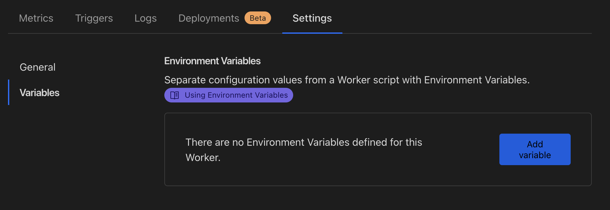
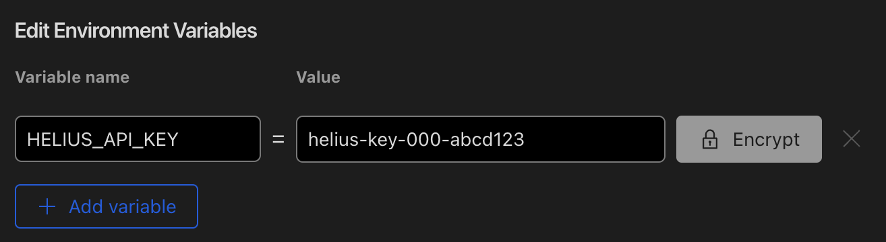
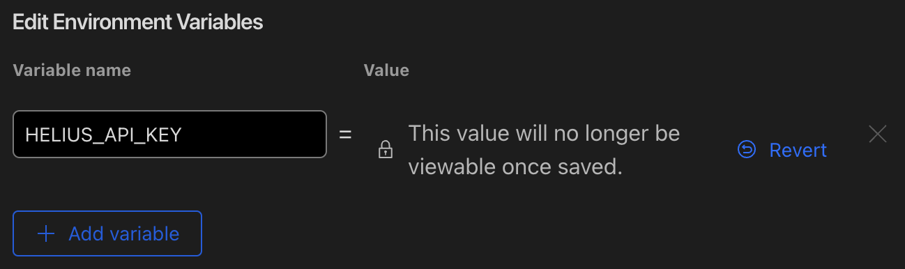
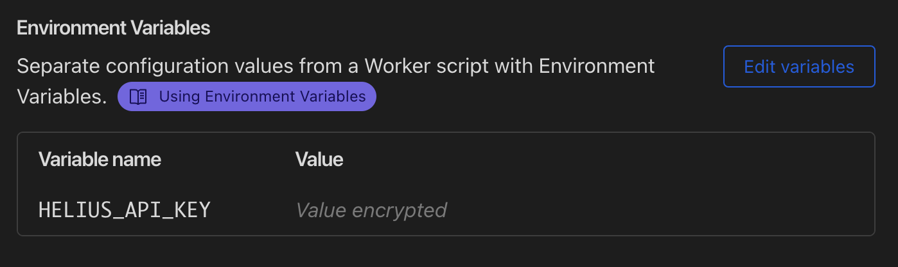

# Helius RPC Proxy

> NOTE: You must have an existing Helius account and API key for this to work! Get one for free at https://helius.xyz.

This repo hosts a one-click-deploy Cloudflare worker that proxies RPC requests to Helius. The proxy will allow you to keep your API key
hidden from public requests made by clients. 

[Video Walktrhough](https://www.loom.com/share/a7add579f1c349d2a4bcab96ee04c47e)

## Additional Security Steps
This implementaiton is intentionally left in a less-than-ideal security state to facilitate easy deployment by anyone. If you would like to 
lock down your RPC proxy further, consider the following steps after you have successfully deployed the worker:

* Update the `Access-Control-Allow-Origin` header in `src/index.ts` to contain the host that your requests are coming from (usually your client application).
* Cloudflare Web Application Firewall (WAF) - You can configure the WAF to inspect requests and allow/deny based on your own business logic.
* Modify the IP address allow list in Helius for your API key to only accept connections from the Cloudflare ranges (https://cloudflare.com/ips-v4).

## Step 1

Press the button below to deploy this to your own Cloudflare account:

## Step 2

Navigate to your newly deployed worker, and click "Settings" and then "Variables":

## Step 3
Add a new variable with the key name `HELIUS_API_KEY` and your Helius API key as the value:

***NOTE:*** We recommend selecting "Encrypt". This will hide your key from the UI and API responses, and redact them from logs.

## Step 4
Refresh the page and confirm that your key is now saved and encrypted:

You can now use your worker URL as an the RPC endpoint in all SDK and client side configurations without your API key leaking!